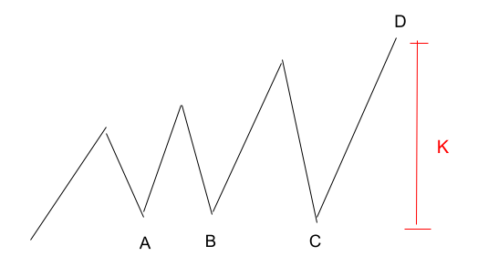

# 560. Subarray Sum Equals K

## Link

https://leetcode.com/problems/subarray-sum-equals-k/description/

## How to work on each step

- Step 1: 答えを見ずに 15 分以内に解く。
- Step 2: 本協会メンバーや LeetCode の過去解答を参考にしつつ、コードを見やすくする形で整える。
- Step 3: 全部消して、10 分以内にエラーを一度も出さずに正解するのを 3 回続けて行う。
- Step 4: いただいたレビューをもとに、コードを整える。

なお、[oda さんの提案](https://discord.com/channels/1084280443945353267/1366778718705553520/1450943270799671337)を参考に、コードを書く部分にフォーカスして Arai60 を1周しています。今回は2周目に当たります。

## Step 1

- 与えられた nums から合計が k と一致する subarray (1つのみも含む)を作成して返すというもの。
- nums を最初から探索していって、累積和を足していく、k と一致したら答えを increment して累積和を0にする、k を超えたら累積和を0に戻すのだけする、という形でいけそう。
- うーむ、k や nums[i] に0以下の値も含むことの考慮が漏れていたことが分かった時点で時間切れになったので gemini に聞いてブラッシュアップする。「k を超えたら」のところがうまく書ききれていなかった。

```py
// 通らない
class Solution:
    def subarraySum(self, nums: List[int], k: int) -> int:
        k_subarray_total = 0
        prefix_total_till_k = 0
        for i in range(len(nums)):
            if nums[i] == k:
                k_subarray_total += 1
                continue
            prefix_total_till_k += nums[i]
            if prefix_total_till_k < k:
                continue
            if prefix_total_till_k > k:
                prefix_total_till_k = 0
                continue
            k_subarray_total += 1
            prefix_total_till_k = nums[i]
        return k_subarray_total
```

- まず、arai60 の hash　map の欄にあったのに hashmap を使った解法を考慮できていなかった。反省。
- gemini に聞きながら書き直し。
- 書いてみてもしっくりこなかったのだが、oda さんの標高差の例をもとに図を書いてみたらかなり腑に落ちた。
  - A, B, C が同じ高さだとし、現在 D を探査しているとし、D とそれらの標高差を k とすると、current_total は D の標高になる。そして、current_total - k は A, B, C の標高にそれぞれ一致する。
  - 
  - https://discord.com/channels/1084280443945353267/1233603535862628432/1252232545056063548
- hash map と k_subarray_total は駅員さんの引き継ぎ用のメモ帳。電車を走行させながら、到着駅の標高と、その駅との標高差が k mの駅が何個あるかをそれぞれの駅時点で書き留めて行っている。
- 想定ユースケース
  - バッチ処理で走る会計消込システムなどだろうか。連続する取引の合計額がちょうど k 円 (あるいは相殺されて合計 0 円)になる期間を検出してアラートを出すとかもできそう。
- 計算量
  - 時間計算量: O(n)
    - 1秒あたり10^7 steps 処理できると仮定すると、nums.length は最大2 * 10^4個になるため、最大で 2 * 10^4 / 10^7 = 0.002s = 2ms ほどかかる見込み。
  - 空間計算量: O(n)
    - nums[i] の組み合わせは最大2001通りなので、len(list(prefix_total_to_frequency)) の最大個数も2001個。k_subarray_total と current_total もそれぞれ考慮して、8B * 2001 + 8B * 2 = 16024B = 最大 16KB 程度になる見込み。

```py
class Solution:
    def subarraySum(self, nums: List[int], k: int) -> int:
        k_subarray_total = 0
        current_total = 0
        prefix_total_to_frequency = defaultdict(int)
        prefix_total_to_frequency[0] = 1
        for num in nums:
            current_total += num
            if current_total - k in prefix_total_to_frequency:
                k_subarray_total += prefix_total_to_frequency[current_total - k]
            prefix_total_to_frequency[current_total] += 1
        return k_subarray_total
```

## Step 2

- `はじめにいわれたときの要件を守らない使われ方が気が付かないうちにされていて、だんだん耐えられなくなって崩壊するわけですね。今回のこのコードは、想定される実行時間がそれほど長くなく、またメモリーも終了したら開放されるので、変なリスクをわざわざ取らないで単純で読みやすいほうに寄せたくなります。上のような事象を引き起こす可能性がとても小さそうだからです。`
  - パフォーマンス不足は意図しない使われ方によって引き起こされる場合もある。今回のケースだと実行時間が短くメモリもすぐ解放されるので多少意図しない使われ方をされたとて、上のような事象は起きにくいと言える。
  - https://github.com/Hurukawa2121/leetcode/pull/16/changes/BASE..b7c1a473b243653b0a5d40f19e7b33b6ba37b733#r1898332261
- `result を使うというのも状況次第ではよいと思っています。多くの場合関数名はしっかりと説明的になっているので、そうならば、「ここに完成品を構築します」という意図がはっきりし、上から読んでいったときに意図が追いやすいこともあるからです。ただ、それは上から読んでいったときに中間状態がどのようなものであるかが推測できる時でしょう。一回、読み手の気持ちになってみましょう。`
  - 今までそもそも result を避けてきていたが、これが答えですよを提示できるというメリットもあるのか。確かに中間状態が不明なまま答えを提示されても、result という変数名には「結果」以外の情報がないのでプロセスがわからないという問題はある。場合によりけりなのだろう。
  - https://github.com/katataku/leetcode/pull/15#discussion_r1898174496
- `略語は避けるが慣習として明らかならよい、という話でしょう。略語は略し方の不一致から、たまに気が付きにくい事故を起こします。`
  - `res` と `result` に関する議論。そこまでして略語を使いたいケースはほぼない気がするので、i とか num とかよくみる略語以外は基本略さないで書くのが好みかも。
  - https://github.com/t0hsumi/leetcode/pull/13#discussion_r1902635530
- `number_of_ は num_ と略すことが多いように思います。 subarray は複数ある場合がありますので、 subarrays と複数形にしたほうが良いと思います。 num_subarrays でいかがでしょうか？`
  - ああ、確かに。`k_subarray_total` と書いていたが、subarray[i] の数字の合計なのか subarray 自体の len なのかが分かりづらいという見方もできるので、なおさら num_subarrays と書くのが良さそう。
  - https://github.com/sakupan102/arai60-practice/pull/17#discussion_r1582005581
- `num_subarraysだと、「和がkのものに限る」というのがわかりにくく感じます。(部分列全部の数かな？と思ってしまう`
  - 一方でこれもしっくりくる。`num_k_subarrays` が良いかな。
  - https://github.com/katataku/leetcode/pull/15/changes#r1903866669
- `この行、やっていることを日本語で書くとどんな感じですか。 ... 2行に分けると「prefixSumToCount に sumAtJ がなければ0で初期化する。」「prefixSumToCount の sumAtJを1増やす。」これは覚えられると思います。computeIfAbsent や getOrDefault を使うというのもありですが、まず、やりたいこととその表現が遠いと感じます。`
  - やりたいこととその表現が遠いと記憶に定着しない。それは確かに。
  - https://discord.com/channels/1084280443945353267/1300342682769686600/1357378682163036160

### 解法1: 2重ループを使う (TLE)

- 参考にした回答
  - https://github.com/hayashi-ay/leetcode/pull/31/changes の 1st
  - https://github.com/olsen-blue/Arai60/pull/16/changes の 1st
- 考えたこと
  - TLE にはなるが、今後の選択肢としてみておきたいと思ったので実装してみる。
  - Python だと`83 / 93 testcases passed` になった。
  - 確かに C++ だと通る。言語間の性能差ってやはりかなりあるのだな。
    - `インタープリタ方式によるオーバーヘッドが大きく、C++ の約 100 倍遅い`
    - https://github.com/Yuto729/leetcode/pull/16#discussion_r2602118324
  - 計算量
    - 時間計算量: O(n^2)
      - Python で1秒あたり10^7 steps 処理できると仮定すると、nums.length は最大2 * 10^4個になるため、最大で (2 * 10^4)^2 / 10^7 = 40s ほどかかる見込み。これは確かに TLE になる。
      - C++ だと 40s / 100 = 0.4s くらいになる。やっぱり早いな。
    - 空間計算量: O(1)
      - 変数は num_k_subarrays と total のみなので nums.length にかかわらず 最大 16B。

```py
class Solution:
    def subarraySum(self, nums: List[int], k: int) -> int:
        num_k_subarrays = 0
        for i in range(len(nums)):
            total = 0
            for j in range(i, len(nums)):
                total += nums[j]
                if total != k:
                    continue
                num_k_subarrays += 1
        return num_k_subarrays
```

### 解法2: defaultdict を使わない

- 参考にした回答
  - https://github.com/hayashi-ay/leetcode/pull/31/changes の 2nd
- 考えたこと
  - prefix_sum_to_frequency の key に prefix_sum や prefix_sum - k がないかどうかの if 文を書くと分岐が多くなりそうだったので、prefix_sum_to_frequency.get() で初期値を設定するようにした。
    - https://docs.python.org/3/tutorial/datastructures.html#dictionaries
  - これはこれで若干横に長くなってみづらい
  - 書いてみて思ったが、step1 の `if current_total - k in prefix_total_to_frequency`はなくても問題なかったのか。
    - こちらの dict() の方が `prefix_sum - k` の key がなかったら 0が代入されるということが明示的な気がするので、if 文がなくても比較的違和感はない
    - が、`defaultdict(int)` を使う時点でヒットしなかったら0を返すことは明らかとも言えるな。悩ましい。
  - 想定ユースケース、計算量は step1 と同じ。

```py
class Solution:
    def subarraySum(self, nums: List[int], k: int) -> int:
        num_k_subarrays = 0
        prefix_sum = 0
        prefix_sum_to_frequency = {}
        prefix_sum_to_frequency[0] = 1
        for num in nums:
            prefix_sum += num
            num_k_subarrays += prefix_sum_to_frequency.get(prefix_sum - k, 0)
            prefix_sum_to_frequency[prefix_sum] = prefix_sum_to_frequency.get(prefix_sum, 0) + 1
        return num_k_subarrays
```

## Step 3

- 考えたこと
  - step 1 とロジックはほぼ同じ。
  - prefix_sum や num_k_subarrays などこのコミュニティでよくみる命名に変更した。
  - defaultdict() を使っているので、key がヒットしなかった時は0を返すことは自明と判断したので、step1 にあった `if current_total - k in prefix_total_to_frequency` を消した。

```py
class Solution:
    def subarraySum(self, nums: List[int], k: int) -> int:
        num_k_subarrays = 0
        prefix_sum = 0
        prefix_sum_to_frequency = defaultdict(int)
        prefix_sum_to_frequency[0] = 1
        for num in nums:
            prefix_sum += num
            num_k_subarrays += prefix_sum_to_frequency[prefix_sum - k]
            prefix_sum_to_frequency[prefix_sum] += 1
        return num_k_subarrays
```

## Step 4


